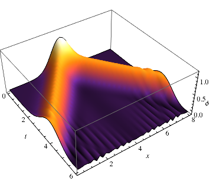

# WaveEq

Fortran script to solve the wave equation numerically, following [this article](http://www.scielo.org.mx/pdf/rmf/v53s4/v53s4a15.pdf).

A Mathematica notebook to visualize the solutions is also included.

The approach and solutions are discussed in `Notes.pdf` (in spanish).

